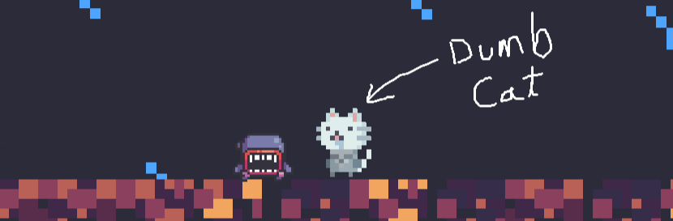

  

# Milk Overdose

You are a silly cat in search of some forbidden milk!

You can play the web version directly on itch.io or download an executable for your local device or compile the project yourself by cloning this repo

**[Play Milk Overdose here](https://omnimistic.itch.io/milk-overdose)**

## Controls

* **Move:** `A` and `D` or `Left / Right Arrow Keys`
* **Jump / Double Jump:** `Space`
* **Attack:** `LMB` (Left Mouse Button) or `X`
* **Slam Attack:** `LMB` or `X` (while in the air)
* **Tele-Sword:** Press `F` to throw the sword, press `F` again to teleport to it

## How to Run Locally

This game was built using Godot 4.7.2. If you want to download the source code and run the game on your own machine, follow these steps:

1. Download or clone this repository to your computer.
2. Download and install Godot Engine version 4.7.2 (or later).
3. Open the Godot Project Manager, click **Import**, and select the `project.godot` file from the downloaded repository folder.
4. Once the project opens in the editor, press the **Run Main Scene** button at the top right (or press `F5`) to start the game.

## Developer Notes

I initially planned on making 10 levels, but due to time constraints, the game currently features 2 levels (including the first tutorial level).

I plan to update the game with more levels and content when I have free time. Have fun playing!
